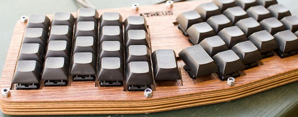
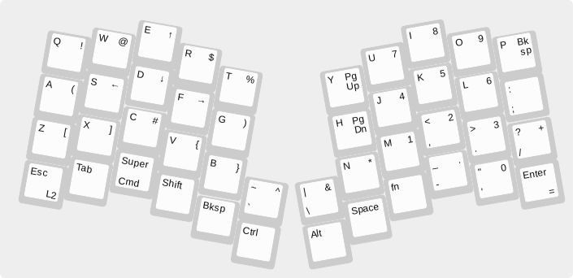

# Menelaus

A firmware for the
[Atreus](http://atreus.technomancy.us) keyboard, written in
[Microscheme](https://ryansuchocki.github.io/microscheme/).

This is my ([jturner](https://github.com/jturner)) personal fork of the
codebase found on [sourcehut](https://git.sr.ht/~technomancy/menelaus).

See [this article about how it works](https://atreus.technomancy.us/firmware).

## Features

* 6KRO (6 simultaneous keys, plus 4 modifiers)
* Software debouncing
* Multiple layers, momentary and sticky (limited only by memory)
* Combo keys (a single keystroke can send a modifier and a non-modifier)
* Bind arbitrary Microscheme functions to a key
* ~300 lines of code
* Qwerty and Dvorak layouts; easy to add more

## Usage

Install [microscheme](https://github.com/ryansuchocki/microscheme/)
from source; place `microscheme` executable on your `$PATH`. Version
3bc5611 from March 2020 is known to work.

Requires [avrdude](https://www.nongnu.org/avrdude/) for uploading
to the controller on the keyboard; install with your package manager
of choice.

Replace `/dev/ttyU0` with the path your OS assigns to the USB
bootloader of the microcontroller.

    $ make upload USB=/dev/ttyU0

Once you run that, put the device in bootloader mode; sometimes this
can be invoked by a key combo and sometimes a hard reset is
necessary. On the A-star Micro used in the Atreus kits, this is done
by shorting GND and RST twice in under a second, which causes the
onboard LED to pulse. The Keyboardio Atreus has a reset button you can
press with a pin to the bottom of the board.

## Layout

By default you get the qwerty layout. You can copy `qwerty.scm` to
`mylayout.scm` and make changes, (you can see a list of available
keycodes in `keycodes.scm`) then upload with:

    $ make upload USB=/dev/ttyU0 LAYOUT=mylayout

There is also a `multidvorak` layout which is designed to send
the right keycodes with the assumption that the OS is set to use
Dvorak, but it also includes layers for "hard Dvorak".

The default layout is based on the Keyboardio Atreus, except that for
older 42-key builds, the percent key is replaced with backtick, and
backslash is fn+semicolon.

## License

Copyright © 2014-2020 Phil Hagelberg and contributors

Released under the [GNU GPL version 3](https://www.gnu.org/licenses/gpl.html)
or any later version.

Uses [PJRC USB Keyboard library](http://www.pjrc.com/teensy/usb_keyboard.html)
which is Copyright © 2009 PJRC.COM, LLC and released under the MIT/X11 license.
